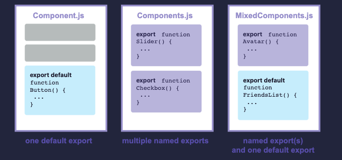
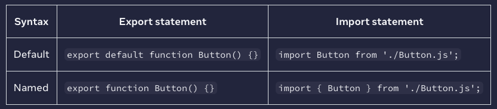

# 1-2장, Importing and Exporting Components

작성자: sikiy
날짜: 2024년 3월 27일
타입: React

# 컴포넌트의 import 및 export

<aside>
💡 컴포넌트의 가장 큰 장점
  ⇒ 재사용성으로 컴포넌트를 조합하여, 또 다른 컴포넌트를 만들 수 있다.

컴포넌트를 여러번 중첩하게 되면 다른 파일로 분리해야 하는 시점이 생긴다.
이렇게 분리하면 나중에 파일을 찾기 더 쉽고 재사용 하기 편리해진다.

</aside>

## 이번 장에서 배울 내용

- 루트 컴포넌트란 무엇인지
- 컴포넌트를 import하고 export하는 방법
- default 및 이름있는 import / export 를 해야 하는 경우
- 하나의 파일에서 여러 컴포넌트를 import / export 하는 방법
- 컴포넌트를 여러 파일로 분할하는 방법

### 루트 컴포넌트 파일

[첫번째 컴포넌트](https://www.notion.so/1-1-Your-First-Component-6273d5414b3b40809fa94e40d5e48862?pvs=21)에서 만든 `Profile` 컴포넌트와 `Gallery` 컴포넌트는 아래와 같이 렌더링됨:

- 코드
    
    ```tsx
    function Profile() {
      return (
        
      );
    }
    
    export default function Gallery() {
      return (
        <section>
          <h1>Amazing scientists</h1>
          <Profile />
          <Profile />
          <Profile />
        </section>
      );
    }
    ```
    
- 결과물
    
    
    

이 예제의 컴포넌트들은 모두 `App.js` 라는 **root 컴포넌트 파일**에 존재한다.

설정에 따라 root 컴포넌트는 다른 파일에 위치할 수도 있다.

Next.js처럼 파일(폴더) 기반으로 라우팅하는 프레임워크의 경우 페이지별로 root 컴포넌트가 다를 수 있음.

### 컴포넌트 import 및 export하기

컴포넌트는 다음 세 단계로 이동(분리)할 수 있다.

1. 컴포넌트를 넣을 js파일을 생성
2. 새로 만든 파일에서 함수 컴포넌트를 **export** 한다. ([default](https://developer.mozilla.org/ko/docs/Web/JavaScript/Reference/Statements/export#using_the_default_export) 또는 [named](https://developer.mozilla.org/ko/docs/Web/JavaScript/Reference/Statements/export#using_named_exports) export 방식)
3. 컴포넌트를 사용할 파일에서 **import** 한다. ([default](https://developer.mozilla.org/ko/docs/Web/JavaScript/Reference/Statements/import#importing_defaults) 또는 [named](https://developer.mozilla.org/ko/docs/Web/JavaScript/Reference/Statements/import#import_a_single_export_from_a_module) export에 대응하는 방식의 import로)

이 예제에선 컴포넌트를 아래와 같이 분리했다.

1. `Gallery.js`
    - 코드
        
        ```tsx
        function Profile() {
          return (
            
          );
        }
        
        export default function Gallery() {
          return (
            <section>
              <h1>Amazing scientists</h1>
              <Profile />
              <Profile />
              <Profile />
            </section>
          );
        }
        
        ```
        
    - 동일한 파일 내에서만 사용하는 export하지 않는 `Profile` 컴포넌트를 정의
    - `Gallery` 컴포넌트를 **default export** 방식으로 export 함
2. `App.js`
    - 코드
        
        ```tsx
        import Gallery from './Gallery.js';
        
        export default function App() {
          return (
            <Gallery />
          );
        }
        
        ```
        
    - `Gallery` 를 `Gallery.js` 로부터 **default import** 방식으로 import 함
    - root `App` 컴포넌트를 **default export** 방식으로 **export** 함

## Note

가끔 `.js` 와 같은 파일 확장자가 없는 때도 있다. (우리가 흔히 보는 방식)

```tsx
import Gallery from './Gallery';
```

React에서는 `'./Gallery.js'`  또는 `'./Gallery'` 둘 다 사용할 수 있지만 전자의 경우가 [ES Modules](https://developer.mozilla.org/ko/docs/Web/JavaScript/Guide/Modules) 사용 방법에 더 가깝다.

## DEEP DIVE | 심층 탐구
| Default vs named exports

보통 JavaScript 에서는 default export와 named export라는 두 가지 방법으로 값을 export 한다. 지금까지의 예제에선 default export만 사용했으나 두 방법 다 한 파일에서 사용할 수도 있다.

**다만 default export는 파일 당 하나의 export만 존재할 수 있고, named export는 여러 개 존재할 수 있다.**



Export 하는 방식에 따라 import 하는 방식이 정해진다. 



default import는 원한다면 import 이후 원하는 다른 이름으로 가져올 수 있다.

```jsx
import Banana from './button.js';
```

하지만 named import는 양쪽 파일에서 사용하고자 하는 값의 이름이 같아야만 한다.

**보편적으론 한 파일에서 하나의 컴포넌트만 export 할 때는 default export 방식을 쓰고, 여러 컴포넌트를 export 할 경우엔 named export 방식을 사용한다.**
export default () ⇒ {}와 같은 익명 컴포넌트는 디버깅이 어렵기 때문에 권장하지 않는다.

### 동일한 파일에서 여러 컴포넌트 import 및 export 하기

**하나의 파일은 default export를 하나만 가질 수 있지만, named export는 여러개 가질 수 있다.**

## Note

default export와 named export 사이의 잠재적인 혼동을 줄이기 위해 일부 팀에서는 한 가지 스타일(default 또는 named)만 고수하거나, 단일 파일 내에서 혼합하지 않도록 선택한다.

상황에 맞는 가장 적합한 방식을 선택할 것.

이 예제에서는 아래와 같이 default와 named export를 하나의 파일에서 둘 다 사용하는 방식으로 구현해보았다.

- `Gallery.js`:
    - `Profile` 컴포넌트를 `Profile`로 **named export** 한다.
    - `Gallery` 컴포넌트를 **default export** 한다.
- `App.js`:
    - `Gallery.js`에서 `Profile`를 `Profile`로 **named import** 한다.
    - `Gallery.js`에서 `Gallery`를 **default import** 한다.
    - root `App` 컴포넌트를 **default export** 한다.
    

## 도전과제: 컴포넌트를 더 분리해보자!

- 현재 `Gallery.js` 는 `Profile` 과 `Gallery` 를 모두 export 하고 있으므로 약간 혼란스러움
- `Profile.js`  파일을 생성해서 `Profile` 컴포넌트를 해당 파일로 옮기고 `App` 컴포넌트에서는 `<Profile />` 과 `<Gallery />` 를 각각 렌더링 하도록 변경해보기
- `Profile` 에 default export 또는 named export를 사용할 수 있는데, `App.js` 와 `Gallery.js` 모두에서 그에 대응하는 import 구문을 사용해야 한다.
- 예제 코드 (시작)
// 이거 근데 예제코드의 App에서 Gallery를 불러왔어야 하는 거 아닌가..?
    
    ```tsx
    // App.js
    import Gallery from './Gallery.js';
    import { Profile } from './Gallery.js';
    
    export default function App() {
      return (
        <div>
          <Profile />
        </div>
      );
    }
    
    // Gallery.js
    // Move me to Profile.js!
    export function Profile() {
      return (
        
      );
    }
    
    export default function Gallery() {
      return (
        <section>
          <h1>Amazing scientists</h1>
          <Profile />
          <Profile />
          <Profile />
        </section>
      );
    }
    
    // Profile.js
    
    ```
    
- 결과 코드
    
    ```tsx
    // App.js
    import Profile from './Profile.js';
    
    export default function App() {
      return (
        <div>
          <Profile />
        </div>
      );
    }
    
    // Gallery.js
    // Move me to Profile.js!
    import Profile from './Profile.js';
    
    export default function Gallery() {
      return (
        <section>
          <h1>Amazing scientists</h1>
          <Profile />
          <Profile />
          <Profile />
        </section>
      );
    }
    
    // Profile.js
    export default function Profile() {
      return (
        
      );
    }
    ```
    

```jsx
button/
  index.ts
  Button.tsx
  IconButton.tsx
  
// index.ts
import Button from './Button'
import IconButton from './IconButton'
 
export default { Button, IconButton }

// other files anti pattern
import { Button, IconButton } from '../button'

// ok
import Button from '../button/Button'
import IconButton from '../button/IconButton'

// 함수이
```

[https://github.com/yeonjuan/dev-blog/blob/master/JavaScript/speeding-up-the-javascript-ecosystem-the-barrel-file-debacle.md?utm_source=substack&utm_medium=email#자바스크립트-에코시스템의-속도-향상---배럴barrel-파일의-대실패](https://github.com/yeonjuan/dev-blog/blob/master/JavaScript/speeding-up-the-javascript-ecosystem-the-barrel-file-debacle.md?utm_source=substack&utm_medium=email#%EC%9E%90%EB%B0%94%EC%8A%A4%ED%81%AC%EB%A6%BD%ED%8A%B8-%EC%97%90%EC%BD%94%EC%8B%9C%EC%8A%A4%ED%85%9C%EC%9D%98-%EC%86%8D%EB%8F%84-%ED%96%A5%EC%83%81---%EB%B0%B0%EB%9F%B4barrel-%ED%8C%8C%EC%9D%BC%EC%9D%98-%EB%8C%80%EC%8B%A4%ED%8C%A8)

```jsx
import Item from './Item';
import Tag from './Tag';

const List = () => {}

List.Item = Item;
List.Tag = Tag;

export default List;
```
