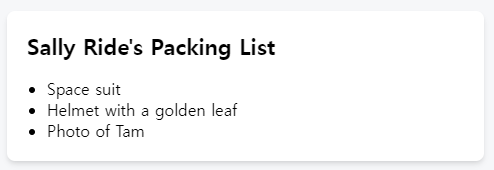
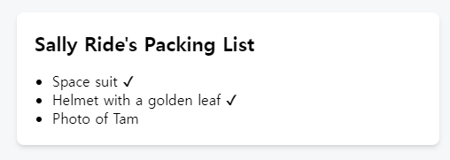
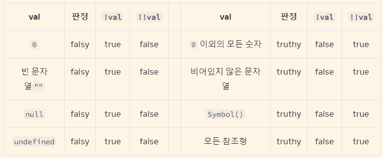

# 1-6 Conditional Rendering (조건부 렌더링)

작성자: sikiy
날짜: 2024년 4월 10일
타입: React

[조건부 렌더링 – React](https://react-ko.dev/learn/conditional-rendering)

## 개요

컴포넌트는 서로 다른 조건에 따라 다른 것을 보여줘야 하는 경우가 자주 발생한다.

React에서는 `if` 문, `&&`, `? :` 연산자 같은 JavaScript 문법을 사용해 조건부로 JSX를 렌더링 할 수 있다.

## 학습 내용

- 조건에 따라 다른 JSX를 반환하는 방법
- 일부 JSX를 조건부로 포함하거나 제외하는 방법
- React 코드베이스에서 흔히 접할 수 있는 조건부 구문 단축 표현

## 조건부로 반환하는 JSX

상품이 포장되었는지 여부를 표시할 수 있는 여러 개의 `Item` 을 렌더링하는 `PackingList` 컴포넌트가 있다고 가정한다면:

- 코드
    
    ```tsx
    function Item({ name, isPacked }) {
      return <li className="item">{name}</li>;
    }
    
    export default function PackingList() {
      return (
        <section>
          <h1>Sally Ride's Packing List</h1>
          <ul>
            <Item 
              isPacked={true} 
              name="Space suit" 
            />
            <Item 
              isPacked={true} 
              name="Helmet with a golden leaf" 
            />
            <Item 
              isPacked={false} 
              name="Photo of Tam" 
            />
          </ul>
        </section>
      );
    }
    
    ```
    
    
    

일부 `Item` 컴포넌트의 `isPacked` prop이 `false`가 아닌 `true`로 설정되어 있는 것을 확인할 수 있다.`isPacked={true}`인 경우, 패킹된 아이템에 체크 표시(✔)를 추가하고 싶을 것.
이를 다음과 같이 `[if`/`else` 문](https://developer.mozilla.org/en-US/docs/Web/JavaScript/Reference/Statements/if...else)으로 작성할 수 있다:

```tsx
if (isPacked) {
  return <li className="item">{name} ✔</li>;
}
return <li className="item">{name}</li>;
```

- 코드
    
    ```tsx
    function Item({ name, isPacked }) {
      if (isPacked) {
        return <li className="item">{name} ✔</li>;
      }
      return <li className="item">{name}</li>;
    }
    
    export default function PackingList() {
      return (
        <section>
          <h1>Sally Ride's Packing List</h1>
          <ul>
            <Item 
              isPacked={true} 
              name="Space suit" 
            />
            <Item 
              isPacked={true} 
              name="Helmet with a golden leaf" 
            />
            <Item 
              isPacked={false} 
              name="Photo of Tam" 
            />
          </ul>
        </section>
      );
    }
    
    ```
    
    
    

JavaScript의 `if`와 `return` 문으로 분기 로직을 처리하였다. React에서 조건과 같은 제어 흐름은 JavaScript로 처리된다.

### `null`을 사용해 조건부로 아무것도 반환하지 않기

어떤 상황에서는 아무것도 렌더링하고 싶지 않을 수도 있는데, 이 경우 `null`을 반환하면 된다:

```tsx
if (isPacked) {
  return null;
}
return <li className="item">{name}</li>;
```

`isPacked`가 참이면 컴포넌트는 아무것도 반환하지 않고 `null`을 반환하고, 그렇지 않으면 렌더링할 JSX를 반환한다.
실제로 컴포넌트에서 `null`을 반환하는 것은 렌더링하려는 개발자를 놀라게 할 수 있기 때문에 일반적이지 않은데, 부모 컴포넌트의 JSX에 컴포넌트를 조건부로 포함하거나 제외하는 경우가 더 많다. (다음에 나오는 것)

## 조건을 포함한 JSX

이전 예제에서는 컴포넌트가 반환할 JSX 트리(있는 경우!)를 제어했는데, 렌더링 출력에서 이미 일부 중복을 발견했을 수 있다:

```tsx
<li className="item">{name} ✔</li>
```

이는 아래와 매우 유사하다.

```tsx
<li className="item">{name}</li>
```

두 조건부 브랜치 모두 `<li className="item">...</li>`를 반환한다:

```tsx
if (isPacked) {
  return <li className="item">{name} ✔</li>;
}
return <li className="item">{name}</li>;
```

이러한 중복은 해롭지는 않지만 코드를 유지 관리하기 어렵게 만들 수 있다. `className`을 변경하려면 유지보수시 코드의 두 곳에서 변경해야 할 것..! 이런 상황에서는 조건부로 약간의 JSX를 포함시켜 코드를 더 [DRY](https://en.wikipedia.org/wiki/Don%27t_repeat_yourself)하게(덜 반복적이게) 만들 수 있다.

### 조건(삼항) 연산자(`? :`)

JavaScript에는 [조건 연산자](https://developer.mozilla.org/ko/docs/Web/JavaScript/Reference/Operators/Conditional_Operator) 또는 “삼항 연산자”라는 조건식 작성을 위한 간결한 구문이 있다.

```tsx
if (isPacked) {
  return <li className="item">{name} ✔</li>;
}
return <li className="item">{name}</li>;

// 대신에

return (
  <li className="item">
    {isPacked ? name + ' ✔' : name}
  </li>
);
```

*“`isPacked`가 참이면 (`?`) `name + ' ✔'`를 렌더링하고, 그렇지 않으면 (`:`) `name`을 렌더링하라”* 라고 읽을 수 있다.

### DEEP DIVE | 이 두 예제는 완전히 동일할까?

객체 지향 프로그래밍에 익숙하다면, 위의 두 예제 중 하나가 `<li>`의 서로 다른 두 “인스턴스”를 생성할 수 있기 때문에 미묘하게 다르다고 생각할 수 있다.

하지만, JSX 요소는 내부 state를 보유하지 않고 실제 DOM 노드가 아니기 때문에 “인스턴스”가 아니다. 이는 청사진과 같은 가벼운 설명이고 이 두 예제는 사실 완전히 동등하다. [state 보존 및 재설정](https://react-ko.dev/learn/preserving-and-resetting-state)에서 작동 방식에 대해 자세히 설명한다.

이제 완성된 항목의 텍스트를 `<del>`과 같은 다른 HTML 태그로 감싸서 줄을 긋고 싶다고 가정해 보자. 더 많은 개행과 괄호를 추가하여 대소문자를 더 쉽게 중첩할 수 있다:

- 코드
    
    ```tsx
    function Item({ name, isPacked }) {
      return (
        <li className="item">
          {isPacked ? (
            <del>
              {name + ' ✔'}
            </del>
          ) : (
            name
          )}
        </li>
      );
    }
    
    export default function PackingList() {
      return (
        <section>
          <h1>Sally Ride's Packing List</h1>
          <ul>
            <Item 
              isPacked={true} 
              name="Space suit" 
            />
            <Item 
              isPacked={true} 
              name="Helmet with a golden leaf" 
            />
            <Item 
              isPacked={false} 
              name="Photo of Tam" 
            />
          </ul>
        </section>
      );
    }
    ```
    

이런 스타일은 간단한 조건에 적합하지만 적당히 사용해야 한다. 중첩된 조건 마크업이 너무 많아 컴포넌트가 지저분해지면 자식 컴포넌트를 추출해서 정리하는 것을 고려하라.

React에서 마크업은 코드의 일부이므로 변수나 함수와 같은 도구를 사용해 복잡한 표현식을 정리할 수 있다.

### 논리 AND 연산자(`&&`)

또 다른 일반적인 단축표현으로 [JavaScript AND(`&&`) 논리 연산자](https://developer.mozilla.org/en-US/docs/Web/JavaScript/Reference/Operators/Logical_AND)가 있다. React 컴포넌트 내에서 조건이 참일 때 일부 JSX를 렌더링하거나 **그렇지 않으면 아무것도 렌더링하지 않으려** 할 때 자주 사용되는데, `&&`를 사용하면 `isPacked`가 `true`일 때만 조건부로 체크 표시를 렌더링할 수 있다:

```tsx
return (
  <li className="item">
    {name} {isPacked && '✔'}
  </li>
);
```

이는 *“만약 `isPacked`이면 (`&&`) 체크 표시를 렌더링하고, 그렇지 않으면 아무것도 렌더링하지 않는다”* 로 읽을 수 있다.

[JavaScript && 표현식](https://developer.mozilla.org/en-US/docs/Web/JavaScript/Reference/Operators/Logical_AND)은 왼쪽(조건)이 `true`이면 오른쪽(이 경우 체크 표시)의 값을 반환한다. 하지만 조건이 `false`이면 표현식 전체가 `false`가 된다. React는 `false`를 `null`이나 `undefined`와 마찬가지로 JSX 트리상의 “구멍”으로 간주하고, 그 자리에 아무것도 렌더링하지 않는다.

### Pitfall | 함정

**`&&`의 왼쪽에 숫자를 넣지 마세요.**
조건을 테스트하기 위해, JavaScript는 왼쪽을 자동으로 불리언으로 변환한다. 그러나 왼쪽이 `0` 과 같은 숫자라면 전체 표현식이 해당 값(`0`)을 가져오고, React는 기꺼이 빈 값 대신 `0`을 렌더링한다.

예를 들어, 흔히 하는 실수 중 하나는 `messageCount && <p>New messages</p>`와 같은 코드를 작성하는 것. `messageCount`가 `0`일 때 아무것도 렌더링하지 않는다고 생각하기 쉽지만, 실제로는 `0` 자체를 렌더링 한다.
이 문제를 해결하려면 왼쪽을 불리언으로 만들면 된다: `messageCount > 0 && <p>...`

**EXTRA COMMENT**

`!!messageCount && <p>New messages</p>`도 된다.

어떤 변수 앞의 [NOT 논리 연산자 `!`](https://developer.mozilla.org/en-US/docs/Web/JavaScript/Reference/Operators/Logical_NOT)는 바로 뒤따르는 변수가, `true`로 변환할 수 있는 값인 경우(`[truthy](https://developer.mozilla.org/en-US/docs/Glossary/Truthy)`)에는 `false`를, `false`로 변환할 수 있는 값인 경우(`[falsy](https://developer.mozilla.org/en-US/docs/Glossary/Falsy)`)에는 `true`를  반환한다.

NOT 논리 연산자 `!`를 두 번 연속으로 작성하면(Double NOT `!!`) 이중 부정이 되어, `truthy` 값은 `true`를, `falsy` 값은 `false`를 반환한다.



### 변수에 조건부로 JSX 할당하기

단축키가 일반 코드를 작성하는 데 방해가 된다면 `if` 문과 변수를 사용해보라. `let`으로 정의된 변수는 재할당 할 수 있으므로, 표시할 기본 콘텐츠인 이름을 지정하는 것부터 시작하라:

```tsx
let itemContent = name;
```

`if`문을 사용해서 `isPacked`가 `true` 면 JSX 표현식을 `itemContent`에 재할당 한다:

```tsx
if (isPacked) {
  itemContent = name + " ✔";
}
```

[중괄호는 “JavaScript로의 창”을 연다](https://react-ko.dev/learn/javascript-in-jsx-with-curly-braces#using-curly-braces-a-window-into-the-javascript-world). 중괄호로 변수를 반환된 JSX 트리에 삽입하여 이전에 계산된 표현식을 JSX 안에 중첩시킨다:

```tsx
<li className="item">
  {itemContent}
</li>
```

아래처럼 텍스트 뿐만 아니라 임의의 JSX에서도 작동한다:

```tsx
function Item({ name, isPacked }) {
  let itemContent = name;
  if (isPacked) {
    itemContent = (
      <del>
        {name + " ✔"}
      </del>
    );
  }
  return (
    <li className="item">
      {itemContent}
    </li>
  );
}
```

## Recap | 요약

- React에서는 JavaScript로 분기 로직을 제어한다.
- `if`문으로 조건부로 JSX 표현식을 반환할 수 있다.
- 중괄호를 사용하여 일부 JSX를 변수에 조건부로 저장한 다음 다른 JSX 안에 포함할 수 있다.
- JSX에서 `{cond ? <A /> : <B />}`는 “`cond`가 있으면 `<A />`를 렌더링하고, 그렇지 않으면 `<B />`를 렌더링하라”를 의미한다.
- JSX에서 `{cond && <A />}`는 *“`cond`가 있으면 `<A />`를 렌더링하고, 그렇지 않으면 아무것도 렌더링하지 말라”를* 의미한다.
- 이 단축용법은 흔히 쓰이지만, 만약 `if`를 선호한다면 굳이 사용하지 않아도 된다.

## Challenges | 도전 과제

- **1. `? :`로 미완료 항목 아이콘 표시하기**
    
    Use the conditional operator (`cond ? a : b`) to render a ❌ if `isPacked` isn’t `true`.
    조건 연산자(`cond ? a : b`)를 사용하여 `isPacked`가 `true`가 아닌 경우 ❌를 렌더링하세요.
    
    [https://react-ko.dev/learn/conditional-rendering#show-an-icon-for-incomplete-items-with--](https://react-ko.dev/learn/conditional-rendering#show-an-icon-for-incomplete-items-with--)
    
- **2. `&&`로 항목의 중요도 표시하기**
    
    이 예제에서 각 `Item`은 숫자형의 `importance` prop을 받습니다. 연산자 `&&`를 사용하여 “*(importance: X)*“를 이탤릭체로 렌더링하되, 중요도가 0이 아닌 항목에 대해서만 렌더링 하세요. 항목 목록은 다음과 같은 모양이 됩니다:
    
    - Space suit *(Importance: 9)*
    - Helmet with a golden leaf
    - Photo of Tam *(Importance: 6)*
    
    두 레이블 사이에 공백을 추가하는 것을 잊지 마세요!
    
    [https://react-ko.dev/learn/conditional-rendering#show-the-item-importance-with-](https://react-ko.dev/learn/conditional-rendering#show-the-item-importance-with-)
    
- **3**. **일련의 `? :` 를 `if` 및 변수로 리팩터링하세요**
    
    이 `Drink` 컴포넌트는 일련의 `? :` 조건을 사용하여 `name` prop이 `"tea"` 또는 `"coffee"`인지 여부에 따라 다른 정보를 표시합니다. 문제는 각 음료에 대한 정보가 여러 조건에 분산되어 있다는 것입니다. 이 코드를 리팩터링하여 세 개의 `? :` 조건 대신 하나의 `if` 문을 사용하세요.
    
    [https://react-ko.dev/learn/conditional-rendering#refactor-a-series-of---to-if-and-variables](https://react-ko.dev/learn/conditional-rendering#refactor-a-series-of---to-if-and-variables)
    
    `if`를 사용하도록 코드를 리팩토링한 후에, 이를 더 단순화할 수 있는 아이디어가 있나요?
